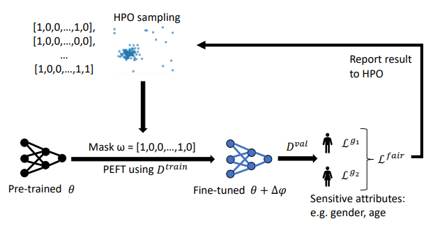

# *FairTune*: Optimizing Parameter-Efficient Fine-Tuning for Fairness in Medical Image Analysis

  

Abstract: Training models with robust group fairness properties is crucial in ethically sensitive application areas such as medical diagnosis. Despite the growing body of work aiming to minimise demographic bias in AI, this problem remains challenging. A key reason for this challenge is the fairness generalisation gap: High-capacity deep learning models can fit all training data nearly perfectly, and thus also exhibit perfect fairness during training. In this case, bias emerges only during testing when generalisation performance differs across subgroups. This motivates us to take a bi-level optimisation perspective on fair learning: Optimising the learning strategy based on validation fairness. Specifically, we consider the highly effective workflow of adapting pre-trained models to downstream medical imaging tasks using parameter-efficient fine-tuning (PEFT) techniques. There is a trade-off between updating more parameters, enabling a better fit to the task of interest vs. fewer parameters, potentially reducing the generalisation gap. To manage this tradeoff, we propose *FairTune*, a framework to optimise the choice of PEFT parameters with respect to fairness. We demonstrate empirically that *FairTune* leads to improved fairness on a range of medical imaging datasets. 

## Installation
Python >= 3.8+ and Pytorch >=1.10 are required for running the code.  
Main packages: [PyTorch](https://pytorch.org/get-started/locally/), [Optuna](https://optuna.readthedocs.io/en/stable/installation.html), [FairLearn](https://fairlearn.org/v0.9/quickstart.html)


## Dataset Preparation
We follow the steps in [MEDFAIR](https://github.com/ys-zong/MEDFAIR/tree/main) for preparing the datasets. Please see [this page](https://github.com/ys-zong/MEDFAIR/tree/main#data-preprocessing).
Detailed instructions for preparing the datasets are given in the Appendix.

After preprocessing, specify the paths of the metadata and pickle files in `config.yaml`.


### Dataset
Due to the data use agreements, we cannot directly share the download link. Please register and download datasets using the links from the table below:

| **Dataset**  | **Access**                                                                                    |
|--------------|-----------------------------------------------------------------------------------------------|
| CheXpert     | https://stanfordmlgroup.github.io/competitions/chexpert/                                      |
| OL3I         | https://stanfordaimi.azurewebsites.net/datasets/3263e34a-252e-460f-8f63-d585a9bfecfc          |
| PAPILA       | https://www.nature.com/articles/s41597-022-01388-1#Sec6                                       |
| HAM10000     | https://dataverse.harvard.edu/dataset.xhtml?persistentId=doi:10.7910/DVN/DBW86T               |
| Oasis-1      | https://www.oasis-brains.org/#data                                                            |
| Fitzpatrick17k | https://github.com/mattgroh/fitzpatrick17k                                                  |
| Harvard-GF3300  |  https://ophai.hms.harvard.edu/datasets/harvard-glaucoma-fairness-3300-samples/            |


### Run HPO search for finding the best mask (Stage 1)
```python
python search_mask.py --model [model] --epochs [epochs] --batch-size [batch-size] \
     --opt [opt] --lr [lr] --lr-scheduler [lr-scheduler] --lr-warmup-method [lr-warmup-method] --lr-warmup-epochs [lr-warmup-epochs] 
     --tuning_method [tuning_method] --dataset [dataset] --sens_attribute [sens_attribute] \
     --objective_metric [objective_metric] --num_trials [num_trials] --disable_storage --disable_checkpointing
```
`The mask would be saved in the directory FairTune/<model>/<dataset>/<Optuna_Masks>/`

You can use different types of metrics as objectives for the HPO search. Please check `parse_args.py` for more options.

### Fine-Tune on the downstream task using the searched mask (Stage 2)
```python
python finetune_with_mask.py --model [model] --epochs [epochs] --batch-size [batch-size] \
     --opt [opt] --lr [lr] --lr-scheduler [lr-scheduler] --lr-warmup-method [lr-warmup-method] --lr-warmup-epochs [lr-warmup-epochs] 
     --tuning_method [tuning_method] --dataset [dataset] --sens_attribute [sens_attribute] \
    --cal_equiodds --mask_path [mask_path] --cal_equiodds --use_metric auc
```
`The results would be saved in a CSV file located at FairTune/<model>/<dataset>/`

`Note: It is advisable to use a weighted loss when working with Papila and OL3I datasets because of high imbalance, hence, use the --compute_cw argument.`


